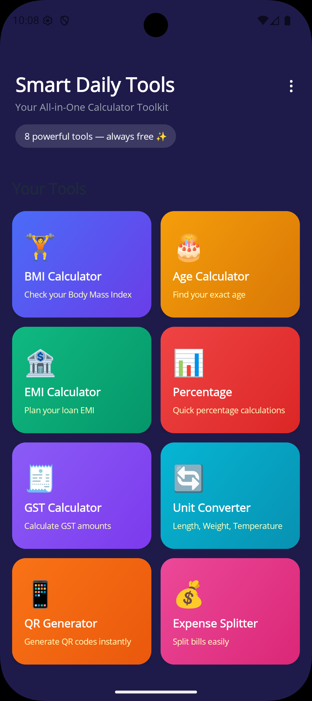

# Smart Daily Tools

**Your All-in-One Calculator Toolkit** — 8 powerful tools, always free ✨

Smart Daily Tools is a cross-platform mobile application built with **.NET MAUI** that bundles everyday calculators and utilities into a single, beautifully designed app. It features a modern dark-themed UI, persistent calculation history, and rich data visualizations powered by Syncfusion controls.

<p align="center">
  
</p>

---

## Features

| Tool | Description |
|------|-------------|
| 🏋️ **BMI Calculator** | Calculate your Body Mass Index with weight/height inputs, view category breakdown via doughnut chart, and track trends over time with a line chart |
| 🎂 **Age Calculator** | Find your exact age in years, months, and days from your date of birth, plus total days lived |
| 🏦 **EMI Calculator** | Plan loan EMIs by entering loan amount, interest rate, and tenure — see monthly EMI, total interest, and a principal vs. interest comparison chart |
| 📊 **Percentage Calculator** | Four modes — "X% of Y", "What % is X of Y", "% Increase", and "% Decrease" — with dynamic input labels |
| 🧾 **GST Calculator** | Calculate GST amounts with preset rate options and a pie chart showing base vs. tax proportions |
| 🔄 **Unit Converter** | Convert between units of Length (8 units), Weight (6 units), and Temperature (3 units) with a one-tap swap button |
| 📱 **QR Generator** | Generate QR codes instantly from any text or URL (up to 500 characters) |
| 💰 **Expense Splitter** | Split bills among multiple people with optional tip percentage |

### Cross-Cutting Capabilities

- **Calculation History** — every tool automatically saves results to a local SQLite database; view, review, or delete past calculations at any time
- **Light & Dark Themes** — full `AppThemeBinding` support; the UI adapts to your system preference or manual toggle in Settings
- **Data Visualizations** — Syncfusion Charts (doughnut, line, column, and pie) bring results to life
- **Shimmer Loading** — smooth loading animations across all tool pages
- **Settings** — toggle dark mode, clear all history, and view app information

---

## Screenshots

<p align="center">
  
  &nbsp;&nbsp;
  
  &nbsp;&nbsp;
  
</p>

> **Note:** Place your screenshots in the `screenshots/` folder at the repository root. Suggested filenames: `home.png`, `bmi.png`, `age.png`, `emi.png`, `percentage.png`, `gst.png`, `unit_converter.png`, `qr.png`, `expense_splitter.png`, `settings.png`.

---

## Tech Stack

| Layer | Technology |
|-------|------------|
| **Framework** | [.NET MAUI](https://dotnet.microsoft.com/apps/maui) (.NET 10) |
| **Architecture** | MVVM (CommunityToolkit.Mvvm) |
| **UI Controls** | [Syncfusion .NET MAUI](https://www.syncfusion.com/maui-controls) v32.2.5 — Inputs, DataGrid, Charts, TabView, Barcode, Shimmer |
| **Database** | SQLite (sqlite-net-pcl) |
| **Platforms** | Android 5.0+, iOS 15+, Mac Catalyst 15+, Windows 10 (17763+) |

---

## Project Structure

```
SmartDailyTools/
├── Data/               # SQLite database service & interface
├── Helpers/            # Constants, value converters
├── Models/             # Data models for each tool's history
├── Platforms/          # Platform-specific code (Android, iOS, Mac, Windows)
├── Resources/          # Fonts, images, styles, splash screen
├── Services/           # Business logic (BMI, Age, EMI, Unit Converter)
├── ViewModels/         # MVVM ViewModels for each page
└── Views/              # XAML pages for all tools and app sections
```

---

## Getting Started

### Prerequisites

- [.NET 10 SDK](https://dotnet.microsoft.com/download/dotnet/10.0) or later
- .NET MAUI workload installed (`dotnet workload install maui`)
- A valid [Syncfusion license key](https://www.syncfusion.com/sales/pricing)
- **Android:** Android SDK with API 21+
- **iOS/Mac:** Xcode 15+ on macOS
- **Windows:** Windows 10 SDK (17763+)

### Setup

1. **Clone the repository**
   ```bash
   git clone https://github.com/your-username/SmartDailyTools.git
   cd SmartDailyTools
   ```

2. **Add your Syncfusion license key**  
   Open `SmartDailyTools/Helpers/AppConstants.cs` and replace the placeholder:
   ```csharp
   public const string SyncfusionLicenseKey = "YOUR_LICENSE_KEY_HERE";
   ```

3. **Restore dependencies**
   ```bash
   dotnet restore
   ```

4. **Build & Run**
   ```bash
   # Android
   dotnet build -t:Run -f net10.0-android

   # Windows
   dotnet build -t:Run -f net10.0-windows10.0.19041.0

   # iOS (macOS only)
   dotnet build -t:Run -f net10.0-ios

   # Mac Catalyst (macOS only)
   dotnet build -t:Run -f net10.0-maccatalyst
   ```

---

## License

This project is for educational and demonstration purposes. Syncfusion controls require a valid license — see [Syncfusion Community License](https://www.syncfusion.com/sales/communitylicense) for free options.
