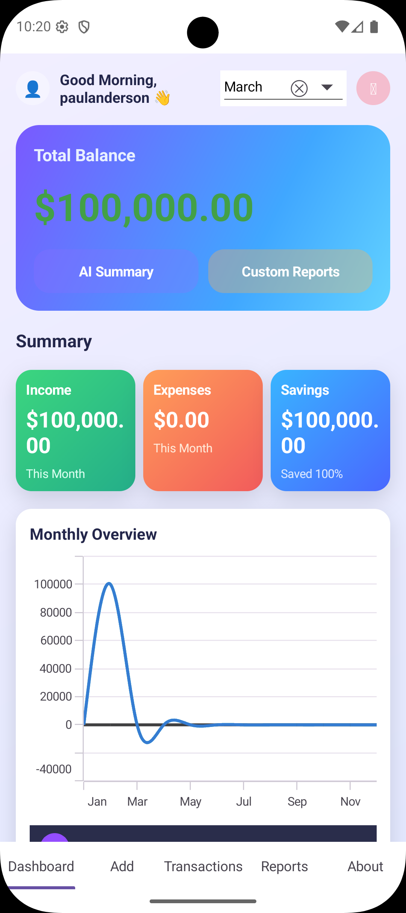

# SmartExpense

A cross-platform personal finance management app built with **.NET MAUI** and **Syncfusion UI controls**. Track income and expenses, view dashboard summaries, generate PDF reports, and get AI-powered financial insights — all with a modern, theme-adaptive UI.

<p align="center">
  
</p>

## Features

### Dashboard
- Personalized greeting based on time of day
- Total balance card with color-coded indicators
- Monthly summary cards: **Income**, **Expenses**, and **Savings** (with savings rate percentage)
- Interactive **Monthly Overview** spline chart (Income / Expense / Savings trends)
- **Category Breakdown** doughnut chart
- Month selector to filter data
- Quick-action buttons for **AI Summary** and **Custom Reports**

### Transaction Management
- Add income or expense transactions with title, amount, category, date, and notes
- Edit and delete existing transactions
- Filter transactions by month
- 8 pre-seeded categories with emoji icons: Salary, Freelance, Food, Travel, Shopping, Health, Utilities, Other

### Reports & PDF Export
- Monthly financial summary (Income, Expense, Net balance)
- Export detailed PDF reports including:
  - Month/year header
  - Income/Expense/Net summary
  - Category breakdown pie chart
  - Full transaction table with pagination
- Share reports via the native share dialog

### AI-Powered Insights
- Rule-based financial summary with savings rate evaluation
- Top spending category identification
- On Android: launch **Gemini / Google Assistant** with financial context pre-filled for deeper analysis

### Authentication
- Local user accounts with SHA-256 hashed passwords
- Persistent sessions via `SecureStorage`
- Login and Registration screens

### Theming
- Light and Dark mode support
- Theme-adaptive gradients and colors throughout the UI

## Tech Stack

| Layer | Technology |
|---|---|
| Framework | .NET MAUI (.NET 10) |
| Language | C# |
| Architecture | MVVM + Repository Pattern + Dependency Injection |
| Database | SQLite (`sqlite-net-pcl`) |
| UI Controls | Syncfusion .NET MAUI (Charts, DataGrid, TabView, Inputs, Picker, Shimmer) |
| MVVM Toolkit | CommunityToolkit.Mvvm |
| PDF Generation | Syncfusion.Pdf.Net.Core |
| Messaging | WeakReferenceMessenger (CommunityToolkit) |

## Project Structure

```
SmartExpense/
├── Models/          # Data entities (Transaction, Category, AppUser, enums, DTOs)
├── Data/            # Repository interfaces & implementations, SQLite context
├── Services/        # Business logic (Auth, Transactions, Reports, Theme, DeviceAI)
├── ViewModels/      # MVVM ViewModels with CommunityToolkit source generators
├── Views/           # XAML pages (Dashboard, Add, Transactions, Reports, About, Login, Register)
├── Helpers/         # Constants, seed data, converters, messenger messages
├── Platforms/       # Platform-specific code (Android DeviceAIService, etc.)
└── Resources/       # Fonts, images, icons, styles, splash screen
```

## Prerequisites

- [.NET 10 SDK](https://dotnet.microsoft.com/download/dotnet/10.0)
- .NET MAUI workload:
  ```bash
  dotnet workload install maui
  ```
- **Syncfusion License Key** — register for a [free Community License](https://www.syncfusion.com/products/communitylicense) or a paid license
- **Android SDK** (API 21+ / Android 5.0+) for Android builds
- **Windows 10 SDK** (build 17763+) for Windows builds (Windows only)

## Getting Started

1. **Clone the repository**
   ```bash
   git clone https://github.com/your-username/SmartExpense.git
   cd SmartExpense
   ```

2. **Set your Syncfusion license key**

   Open `Helpers/AppConstants.cs` and replace the placeholder:
   ```csharp
   public const string SyncfusionLicenseKey = "YOUR_SYNCFUSION_LICENSE_KEY";
   ```

3. **Restore packages and build**
   ```bash
   dotnet restore
   dotnet build
   ```

4. **Run on Android**
   ```bash
   dotnet build -t:Run -f net10.0-android
   ```

## Navigation

The app uses a Syncfusion `SfTabView` with five bottom tabs:

| Tab | Description |
|---|---|
| **Dashboard** | Overview of finances with charts and summary cards |
| **Add** | Create a new income or expense transaction |
| **Transactions** | View, edit, and delete transactions filtered by month |
| **Reports** | Monthly reports with PDF export and sharing |
| **About** | App information |

## Database

SQLite database (`smartexpense.db3`) is created automatically on first launch in the app data directory. Tables for `Transaction`, `Category`, and `AppUser` are auto-created, and default categories are seeded if the table is empty.

## License

This project uses [Syncfusion .NET MAUI controls](https://www.syncfusion.com/maui-controls), which require a valid license key.
